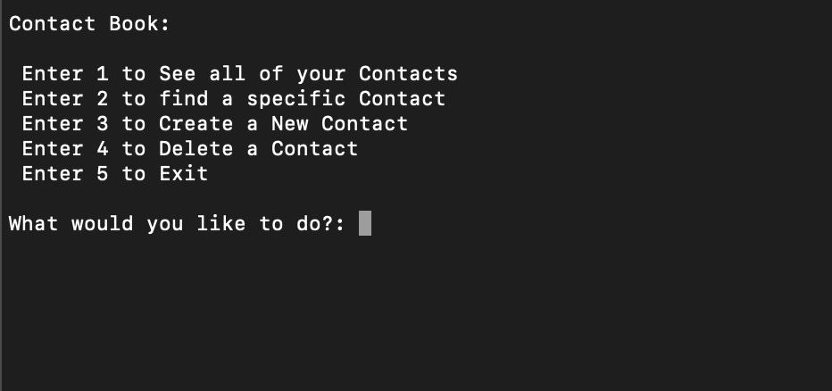

# Python Contact Book

Command Line Python app you can use to keep track of all your contacts!

# Features

* List all of your Contacts
* Find a specific contact by their first name
* Create new Contacts
* Delete Contacts

# How to Install/Use
1. Fork and Clone this Repository
2. Install Dependencies using Pipenv
* pipenv install peewee
* pipenv install psychopg2
3. Create a PostgreSQL database using psql
* CREATE DATABASE contacts;
4. Run the Program!
* pipenv run python app.py

# Authors

Nate Sanchez

# Technologies used

* Python
* PostgreSQL
* Pipenv/Pyenv
* peewee
* pyscopg2

